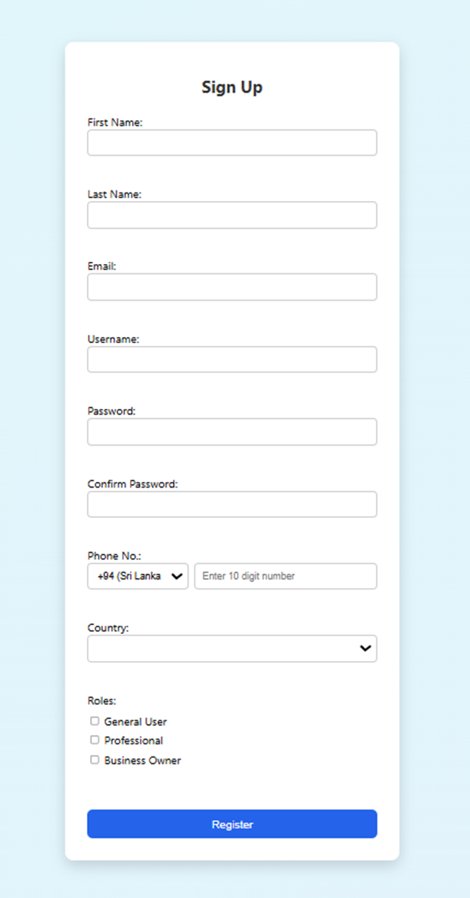
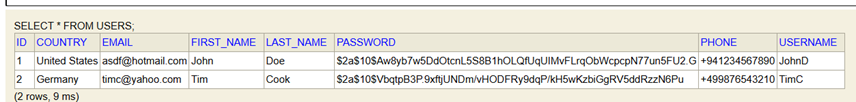
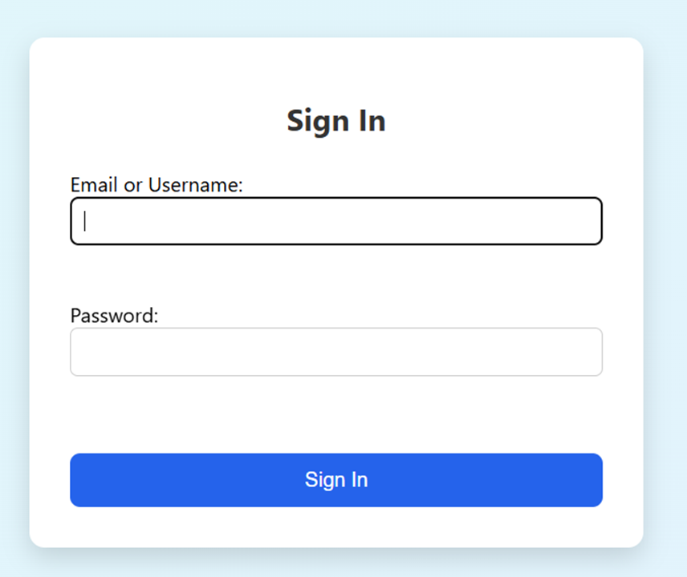

# Multi-Role User Sign-Up Form

## 📌 Project Overview
This project is a **user registration system** with a Spring Boot backend and a Next.js frontend.  
It allows users to register by providing personal details and selecting one or more roles (General User, Professional, Business Owner).

The project was built as part of an internship assignment.

---

## 🏗 Tech Stack
- **Backend**: Spring Boot, H2 Database, Spring Security (BCrypt password hashing)
- **Frontend**: Next.js, React Hook Form, Zod validation
- **Tools**: Maven, TypeScript, REST API, Axios

---

## 📂 Project Structure
project-root/
│── backend/ # Spring Boot backend
│ ├── src/...
│ └── pom.xml
│
│── frontend/ # Next.js frontend
│ ├── pages/
│ ├── services/
│ ├── styles.css
│ └── package.json
│
│── README.md
│── TIME_LOG.md


---

## 🚀 Setup Instructions

### Backend (Spring Boot)
1. Open a terminal in the `backend` folder.
2. Run:
   ```bash
   ./mvnw spring-boot:run
(On Windows PowerShell, use mvnw spring-boot:run).
3. The backend runs on http://localhost:8080
.
4. H2 Console: http://localhost:8080/h2-console

JDBC URL: jdbc:h2:mem:testdb

User: sa

Password: (leave blank)

### Frontend (Next.js)

1. Open a terminal in the frontend folder.

2. Install dependencies:

npm install


3. Run the development server:

npm run dev


4. Open in browser: http://localhost:3000


### 🧪 Features Implemented

* User registration with:

  - First name, Last name

  - Email (validated)

  - Username

  - Password + Confirm Password (≥8 chars, must match)

  - Phone number with country code dropdown

  - Country selection (dropdown)

  - Role selection (checkboxes, multiple allowed)

* Client-side validation with helpful error messages

* Password hashing (BCrypt) before saving

* Responsive UI (works on desktop & mobile)

* Redirects to Sign In page after successful registration

* H2 database integration (view users in H2 console)


📸 Demo









🔒 Security

Passwords are stored securely using BCrypt hashing.

Backend validation ensures invalid data cannot be saved.

📄 License

This project was created as part of an internship assignment at AZE IT Inc.